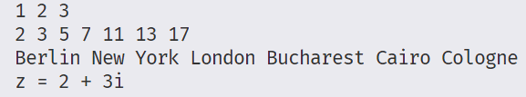

C++ 的统一初始化（Uniform Initialization）是C++11引入的特性 ，允许使用一致的语法来初始化各种变量和对象，从基本类型到聚合类型都适用。核心是使用大括号 `{}` 进行初始化，即 “大括号初始化（brace initialization）” 。编译器看到`{t1,t2,...tn}`便把`initializer_list<T>`关联到`array<T,n>`，调用函数array的元素可被编译器分解逐一传给函数。以下是详细介绍：
### 语法形式
`类型 变量名 { 参数1, 参数2, ……, 参数n }`  ，例如：
- 初始化基本类型变量：`int num {5};`  。
- 初始化数组：`int arr[] {1, 2, 3};`  。
- 初始化STL容器：`std::vector<int> vec {1, 2, 3};`  。

### 特点及优势
1. **一致性**：为不同类型的初始化提供统一语法，简化代码编写和理解。如初始化 `int` 变量、自定义类对象都可用大括号形式。
2. **避免窄化转换**：不允许发生窄化转换（将值转换为无法完整表示该值的类型 ）。比如 `int a {5.5};` 这样的代码无法通过编译，而 `int a = 5.5;` 在传统C风格C++ 中会隐式转换（截断小数部分 ）。
3. **解决最令人烦恼的解析（Most Vexing Parse）问题**：当编译器难以区分 “对象创建” 和 “函数声明” 时，传统语法可能出现歧义。例如 `std::vector<int> v();` 会被解析为函数声明，而使用统一初始化 `std::vector<int> v{};` 则明确是对象初始化 。 

### 应用场景
1. **动态数组初始化**：`int* ptr = new int[3]{1, 2, 3};`  ，可对动态分配数组进行初始化。
2. **类的成员初始化**：
```cpp
class MyClass {
    int member;
public:
    MyClass(int val) : member{val} {}
};
```
3. **隐式初始化返回对象和函数参数**：
```cpp
class Point {
    int x, y;
public:
    Point(int a, int b) : x(a), y(b) {}
};
Point func() { return {1, 2}; } // 隐式初始化返回对象
void callFunc(Point p) {}
int main() {
    callFunc({3, 4}); // 隐式初始化函数参数
    return 0;
}
```

### 注意事项及陷阱
1. **`auto` 类型推导问题**：使用 `auto` 结合大括号初始化时，类型可能被推导为 `std::initializer_list` 。如 `auto x{1, 2};` ，`x` 类型是 `std::initializer_list<int>`  ，可能并非预期，应谨慎使用。 
2. **容器初始化差异**：以 `std::vector` 为例 ，`std::vector<int> v(5, 0);` 表示创建含5个0的向量；`std::vector<int> v{5, 0};` 表示创建含两个元素（值为5和0 ）的向量，易混淆，使用时需注意。 
3. **构造函数重载选择**：类存在 `std::initializer_list` 类型参数的构造函数重载时，统一初始化语法会 “强烈优先” 调用该重载。如：
```cpp
class MyClass {
public:
    MyClass(int x, double y) {}
    MyClass(std::initializer_list<bool> z) {}
};
MyClass obj{5, 1.0}; // 期望调用第一个构造函数，但实际因第二个存在会报错，因涉及窄化转换
``` 
不过若用空大括号初始化，且类同时有默认构造函数和 `std::initializer_list` 重载构造函数 ，则调用默认构造函数，如 `MyClass obj{};`  。 


+ uniform initialization测试：

