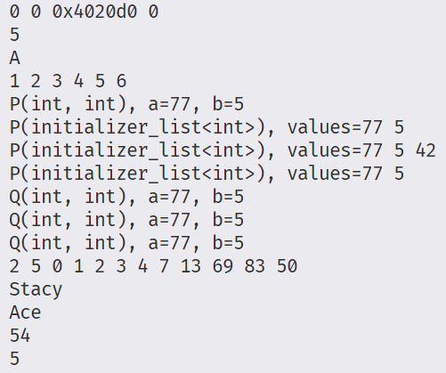

初始化列表对象的构造方式是自动的，就好像分配了一个类型为 T 的元素数组 。列表中的每个元素都使用必要的非缩小隐式转换，被复制初始化为数组中对应的元素。

初始化列表对象引用这个数组的元素，但并不包含它们：复制初始化列表对象会产生另一个引用该相同底层元素的对象，而不会产生新对象（在语义上）。

这个临时数组的生命周期与初始化列表对象的生命周期相同。所以这是一种浅拷贝，是有风险的。

+ initializerList测试：

