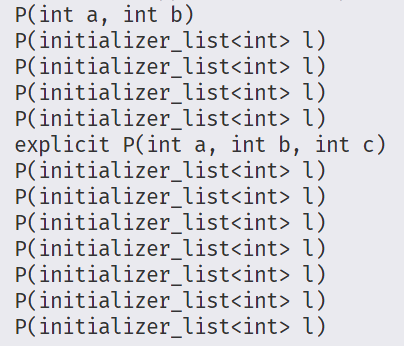

在C++中，`explicit` 关键字主要用于修饰**单参数构造函数**或**除第一个参数外其余参数都有默认值的构造函数**，其核心作用是**禁止隐式类型转换**，仅允许显式的类型转换。以下是详细介绍：


### **1. 隐式类型转换的问题**
当类的构造函数可以通过单个参数调用时，C++允许进行**隐式类型转换**，即将参数类型的对象自动转换为该类的对象。这可能导致意外行为：

```cpp
class String {
public:
    String(const char* s);  // 单参数构造函数
    // ...
};

void printString(const String& str);

int main() {
    printString("hello");  // 隐式转换：const char* → String
}
```

虽然这种转换很方便，但可能导致非预期的代码行为，例如：

```cpp
class Rectangle {
public:
    Rectangle(int width, int height = 1);  // 单参数也可调用
    // ...
};

void drawRectangle(const Rectangle& rect);

int main() {
    drawRectangle(5);  // 隐式转换：int → Rectangle (height=1)
}
```


### **2. `explicit` 的作用**
使用 `explicit` 关键字修饰构造函数后，禁止隐式类型转换，只能通过**显式构造**创建对象：

```cpp
class Rectangle {
public:
    explicit Rectangle(int width, int height = 1);  // 禁止隐式转换
    // ...
};

void drawRectangle(const Rectangle& rect);

int main() {
    drawRectangle(5);  // 错误：无法隐式转换
    drawRectangle(Rectangle(5));  // 正确：显式构造
    drawRectangle(static_cast<Rectangle>(5));  // 正确：显式转换
}
```


### **3. 适用场景**
- **单参数构造函数**：
  ```cpp
  class Complex {
  public:
      explicit Complex(double real);  // 禁止 double → Complex 的隐式转换
  };
  ```

- **除第一个参数外其余参数都有默认值的构造函数**：
  ```cpp
  class Date {
  public:
      explicit Date(int year, int month = 1, int day = 1);  // 禁止 int → Date 的隐式转换
  };
  ```

- **转换运算符**：
  `explicit` 也可用于转换运算符，禁止隐式类型转换：
  ```cpp
  class BoolLike {
  public:
      explicit operator bool() const;  // 只能显式转换为 bool
  };

  BoolLike b;
  if (b) { ... }  // 允许：隐式转换为 bool（C++11 及以后允许）
  bool x = static_cast<bool>(b);  // 正确：显式转换
  bool y = b;  // 错误：禁止隐式转换
  ```


### **4. 为什么需要 `explicit`？**
- **避免意外转换**：防止代码中出现非预期的类型转换，增强类型安全性。
- **明确接口意图**：使类的构造函数的调用方式更加明确，减少歧义。
- **防止错误调用**：例如，避免将整数误用作对象构造参数。


### **5. 注意事项**
- **仅对单参数构造函数有效**：多参数构造函数本身无法用于隐式转换，因此不需要 `explicit`。
- **与 `std::vector` 等容器配合**：
  ```cpp
  std::vector<int> v = 5;  // 错误：若 std::vector 的构造函数是 explicit，则禁止隐式转换
  std::vector<int> v(5);   // 正确：显式构造，创建包含5个元素的 vector
  ```
- **C++11 及以后**：`explicit` 可用于聚合类的构造函数，以及允许在 `if`、`while` 等条件语句中隐式转换为 `bool`。


### **总结**
`explicit` 关键字是C++中用于控制类型转换的重要工具，通过禁止隐式类型转换，提高代码的安全性和可读性。建议在设计单参数构造函数时，除非明确需要隐式转换，否则都应使用 `explicit` 修饰。


+ explicitCtors测试：

