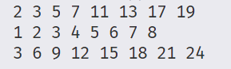

在C++11及以后的版本中，**范围for循环（Range-Based For Loop）** 是一种简化语法，用于遍历可迭代对象（如数组、容器等）。它提供了更简洁、更安全的迭代方式，避免了传统for循环的繁琐语法和潜在错误。


### **1. 基本语法**
```cpp
for (declaration : expression) {
    // 循环体
}
```
- **`declaration`**：声明一个变量，用于表示当前迭代的元素。
- **`expression`**：一个可迭代对象（如数组、`std::vector`、`std::string` 等）。


### **2. 适用范围**
范围for循环适用于以下类型：
- **数组**（静态数组和C风格数组）。
- **实现了 `begin()` 和 `end()` 成员函数**的类（如标准库容器）。
- **通过 `std::begin()` 和 `std::end()` 全局函数**获取迭代器的类型。
- **初始化列表**（`std::initializer_list`）。
- **任何定义了 `begin()` 和 `end()` 自由函数**的类型（自定义容器）。


### **3. 示例**

#### **遍历数组**
```cpp
int arr[] = {1, 2, 3, 4, 5};
for (int num : arr) {
    std::cout << num << " ";
}
// 输出：1 2 3 4 5
```

#### **遍历 `std::vector`**
```cpp
#include <vector>
std::vector<int> vec = {1, 2, 3};
for (auto& element : vec) {  // 使用 auto& 避免拷贝，允许修改
    element *= 2;
}
```

#### **遍历 `std::map`**
```cpp
#include <map>
std::map<int, std::string> m = {{1, "one"}, {2, "two"}};
for (const auto& [key, value] : m) {  // C++17 结构化绑定
    std::cout << key << ": " << value << "\n";
}
```

#### **遍历字符串**
```cpp
std::string str = "hello";
for (char c : str) {
    std::cout << c;
}
```


### **4. 引用与常量引用**
- **普通引用（`auto&`）**：允许修改元素。
- **常量引用（`const auto&`）**：避免拷贝，且不允许修改。
- **值类型（`auto`）**：拷贝元素，修改不会影响原容器。

```cpp
std::vector<int> vec = {1, 2, 3};

for (auto& x : vec) {  // 可修改
    x++;
}

for (const auto& x : vec) {  // 只读，避免拷贝
    std::cout << x;
}
```


### **5. 底层实现原理**
范围for循环本质上是传统迭代器的语法糖，等价于：
```cpp
auto&& __range = expression;  // 保存表达式结果
for (auto __it = begin(__range); __it != end(__range); ++__it) {
    declaration = *__it;      // 将当前元素赋值给声明的变量
    // 循环体
}
```


### **6. 自定义类型支持范围for循环**
要让自定义类型支持范围for循环，需提供：
1. **`begin()` 和 `end()` 成员函数**，或
2. **全局 `begin()` 和 `end()` 函数**，接收该类型对象。

#### **示例：自定义容器**
```cpp
class MyContainer {
private:
    int data[5] = {1, 2, 3, 4, 5};
public:
    int* begin() { return data; }
    int* end() { return data + 5; }
};

MyContainer container;
for (int x : container) {
    std::cout << x;
}
```


### **7. C++20 及以后的扩展**
- **初始化语句**（C++20）：在循环前执行初始化代码。
  ```cpp
  for (int i = 0; auto& x : vec) {  // 初始化 i
      std::cout << i++ << ": " << x;
  }
  ```

- **范围适配器**（C++20）：使用 `std::views` 进行过滤或转换。
  ```cpp
  #include <ranges>
  std::vector<int> vec = {1, 2, 3, 4, 5};
  for (int x : vec | std::views::filter([](int n) { return n % 2 == 0; })) {
      std::cout << x;  // 输出：2 4
  }
  ```


### **8. 注意事项**
- **不要在循环中修改容器大小**：添加或删除元素可能使迭代器失效。
- **避免悬空引用**：若循环体返回引用或指针，需确保容器在引用有效期内不被销毁。
- **空容器安全**：范围for循环自动处理空容器，不会导致越界。


### **总结**
范围for循环是C++中遍历容器和数组的首选方式，它提供了更简洁、更安全的语法，减少了样板代码。通过支持自定义类型和C++20的范围库，它的适用性和灵活性进一步增强。


+ rangeBasedForStatement测试：

